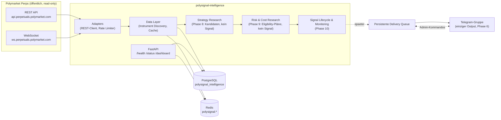

# polysignal-intelligence

Ein **rein lesender** Market-Intelligence- und Signalbot für **Polymarket Perps**.

Der Bot beobachtet ausschließlich **öffentliche** Marktdaten (REST + WebSocket),
bewertet Märkte und Setups regelbasiert und sendet selektive Long-/Short-Signale
in eine private Telegram-Gruppe. **Der Nutzer handelt manuell.**

> ⚠️ **Sicherheitsgrenzen (absolut):** Kein Live-Trading, keine Orderplatzierung,
> keine Wallet-Anbindung, kein Signing, keine privaten Account-/Positionsdaten.
> Telegram ist der einzige externe Output-Kanal. Der Bot ist ein reines
> Informations- und Signalsystem und garantiert keinerlei Performance oder Rendite.

## Status

| Phase | Inhalt | Status |
|-------|--------|--------|
| 1 | Projektisolierung | ✅ |
| 2 | Scaffold, Dependencies, Docker, Settings | ✅ |
| 3 | Datenmodelle, Alembic, PostgreSQL, Redis, Logging, Health | ✅ |
| 4 | Polymarket REST Client, Instrument Discovery | ✅ |
| 5 | WebSocket Data Layer, Orderbuch, Cache/Freshness, Data Quality | ✅ |
| 6 | Telegram Delivery Service, persistente Queue, Admin-Kommandos | ✅ |
| 7 | Market Selection Engine, Session Manager, Kalender, Watchlist | ✅ |
| 8 | Strategy Research Foundation: Marktstruktur, Features, Regime, Setup-Kandidaten (nur Research, keine Signale) | ✅ |
| 9 | Risiko-/Kosten-Engine: technische Invalidation, Referenzrahmen, Margin-Plausibilität, Signal-Eligibility-Pläne (nur Research) | ✅ |
| 10+ | Signal-Lifecycle, Shadow Mode, Backtests | ⏳ geplant |

## Architekturüberblick



Schichtenregeln:
- Strategiecode sendet nie direkt Telegram und führt keine DB-Queries aus.
- Adapter treffen keine Strategieentscheidungen.
- Kosten- und Risiko-Engine sind in Live-/Shadow-/Backtest-Modus identisch.

Details: [`docs/architecture.md`](docs/architecture.md),
[`docs/strategy.md`](docs/strategy.md),
[`docs/risk-and-costs.md`](docs/risk-and-costs.md),
[`docs/operations.md`](docs/operations.md),
[`docs/security.md`](docs/security.md)

## Quick Start

### Voraussetzungen

- [uv](https://docs.astral.sh/uv/) (Python 3.12 wird automatisch bereitgestellt)
- Docker + Docker Compose (für PostgreSQL/Redis bzw. Vollbetrieb)

### 1. Konfiguration

```bash
cp .env.example .env
# .env editieren: POSTGRES_PASSWORD, DATABASE_URL, spaeter TELEGRAM_*
```

Die `.env` wird **ausschließlich** aus dem Repository-Root geladen.

### 2. Vollbetrieb mit Docker Compose

```bash
docker compose up --build -d
curl http://localhost:8000/health
curl http://localhost:8000/status
```

Migrationen laufen beim Containerstart automatisch (`alembic upgrade head`).
Alle Ressourcen sind projektisoliert: Container/Volumes/Netzwerk mit Präfix
`polysignal_`, Datenbank `polysignal_intelligence`, User `polysignal_user`,
Redis-Keys `polysignal:*`.

### 3. Lokale Entwicklung

```bash
uv sync                                   # Environment + Dependencies
docker compose up -d polysignal_postgres polysignal_redis
uv run alembic upgrade head               # Schema anlegen
uv run uvicorn app.main:app --reload      # API starten
```

### 4. Tests & Qualität

```bash
uv run pytest                # Tests (kein Netzwerk, keine echten API-Calls)
uv run ruff check .          # Lint
uv run ruff format --check . # Formatierung
uv run mypy                  # Typen
```

## Konfiguration

Alle Parameter, Schwellenwerte und Secrets kommen aus `.env` /
Environment-Variablen und sind in [`app/config.py`](app/config.py) typisiert.
Wichtige Gruppen: `APP_*`, `DATABASE_*`, `REDIS_*`, `POLYMARKET_*`,
`TELEGRAM_*`, `UNIVERSE_*`, `DATA_QUALITY_*`, `MARKET_SELECTION_*`,
`STRATEGY_*`, `RISK_*`, `COST_*` — siehe kommentierte
[`.env.example`](.env.example).

Marktuniversum V1: `AAPL-PERP` (Equity) und `BTC-PERP` (Crypto); weitere Märkte
nur per Konfiguration. Instrument-IDs werden **nie** fest codiert, sondern per
Discovery über `/v1/info/instruments` aufgelöst.

## Endpoints

| Endpoint | Zweck |
|----------|-------|
| `GET /health` | Prozess, PostgreSQL, Redis, Telegram-Konfig, WebSocket-Liveness/Subscriptions, kritische Channel-Frische, Anzahl `DATA_STALE`-Assets |
| `GET /status` | Botzustand (inkl. Kill Switch), Universum, Connection State, Reconnects, invalide Events, Datenqualität pro Instrument, Orderbuch-Resyncs, Buffer-Statistiken |
| `GET /dashboard` | Kompakte JSON-Übersicht + Metriken + Datenqualität + Strategy-/Risk-Research-Sektionen (Kandidaten, Eligibility-Pläne, Ablehnungen — jeweils mit Research-Disclaimer) |

Ein DB-/Redis-Ausfall degradiert `/health` (503) bzw. liefert `database:
"unavailable"` in `/status` - der Prozess und der Marktdaten-Feed laufen weiter.

## Marktselektion & Sessions (Phase 7)

- **Market Quality Score (0-100)**: reiner Daten-/Liquiditaets-/
  Handelbarkeitsscore (Datenqualitaet 30, Spread 20, Tiefe 20, Volumen 15,
  Marktstatus 10, Preiskonsistenz 5) - kein Setup-Score, keine Richtung.
- **Session Manager**: Equity strikt in `America/New_York` (Regular 09:30-16:00,
  Pre-Market/After-Hours ohne aktive Analyse in V1), versionierter lokaler
  NYSE-Kalender (`us-equity-2026.1`, Abdeckung 2026-2028) mit Feiertagen und
  Early Closes; Crypto 24/7 mit optionalen Thin-Liquidity-Fenstern.
- **Watchlist**: persistente Liste technisch analysierbarer Instrumente
  (keine Trade-Ideen); Allowlist/Denylist, max. Groesse, Priorisierung nach
  Quality Score, Events (ADDED/PAUSED/RESTORED/REMOVED) und unveraenderliche
  Entscheidungs-Historie. Details: `docs/architecture.md`, `docs/strategy.md`.

## Strategy Research (Phase 8)

> **Research-Ausgabe. Kein Trade-Signal. Keine Renditeprognose.**

- Deterministische, versionierte Analysepipeline auf ACTIVE-Watchlist-
  Instrumenten: Multi-Timeframe (1h Regime/Bias → 15m Struktur → 5m
  Bestaetigung), ausschliesslich **geschlossene** Candles (Anti-Look-Ahead),
  keine Interpolation, keine REST-Calls im Strategiepfad.
- Marktstruktur (Swings, HH/HL/LH/LL, BOS/ChoCh nur Close-bestaetigt),
  Liquiditaets-Pools und candle-approximierte Sweeps, Reclaim/Rejection/
  Retest, Volatilitaets-/Momentum-/Volumen-/Orderbuch-Features.
- Genau ein Regime pro Bewertung (TREND_UP/DOWN, RANGE, BREAKOUT,
  HIGH_VOLATILITY, LOW_LIQUIDITY, EVENT_RISK, NO_TRADE, INSUFFICIENT_DATA)
  mit Konfidenz und Gruenden; `NO_TRADE` ist ein gueltiges Ergebnis.
- Sechs Setup-Kandidaten-Klassen mit Score 0-100 (konfigurierbare Gewichte,
  Mindestscore 75) und vollstaendiger Score-Zerlegung; Kandidaten sind
  interne Research-Objekte ohne jegliche Trade-Parameter (testseitig
  erzwungen). Lifecycle: DETECTED → CONFIRMED → REJECTED/EXPIRED/SUPERSEDED
  mit unveraenderlicher Event-Historie und Race-sicherem Dedupe.
- Ablehnungen werden mit strukturierten Codes aggregiert persistiert;
  jede Entscheidung ist ueber Strategieversion, Config-Hash und
  Candle-Fenster reproduzierbar. Details: [`docs/strategy.md`](docs/strategy.md).

## Risk & Cost Research (Phase 9)

> **Risk Research - kein Handelssignal. Keine reale Positions- oder
> Kontodatenbasis.**

- Nimmt ausschließlich **bestätigte** Phase-8-Research-Candidates und prüft
  konservativ, ob daraus ein interner `SignalEligibilityPlan` entstehen
  kann: technische Invalidation (Struktur-Level + BPS/ATR-Buffer),
  Referenz-Entry-Zone (Taker-konservativ aus frischen BBO-Daten),
  technische Referenz-Targets (nie künstlich erzeugt), hypothetische
  Referenzpositionsgröße gegen ein **virtuelles** Referenzkonto.
- Konservative Leverage-Eignung mit hartem V1-Deckel **3x**; Isolated-
  Margin-Forschungsmodell, das ohne öffentliche Margin-Daten blockiert
  (approximiertes Modell nur per explizitem Opt-in, prominent als
  `APPROXIMATED` markiert); Liquidationspuffer als konservative
  Modellprüfung — kein Garant gegen Liquidation.
- Verpflichtende Kosten-Engine auf Notionalbasis: versionierte
  Fee-Schedule-Annahmen (vor Live-Betrieb gegen die offizielle
  Polymarket-Dokumentation zu validieren), Taker-Execution-Annahmen mit
  Stop-Stress, Orderbuch-VWAP-Slippage, konservative Funding-Projektion
  (Funding nie als Ertrag) und Netto-R:R (Default-Minimum 1.8, Kostenanteil
  am Risiko max. 15 %). Nichterfüllung erzeugt strukturierte
  `RiskPlanRejection`s. Details: [`docs/risk-and-costs.md`](docs/risk-and-costs.md).

## Telegram (Phase 6)

- `TELEGRAM_ENABLED=false` ist der sichere Default; ohne Token/Gruppen-ID
  startet die App normal ohne Telegram.
- Alle ausgehenden Nachrichten laufen ueber eine **persistente, idempotente
  Delivery-Queue** (PostgreSQL) mit Prioritaeten, Rate Limits, Retries und
  Dead-Letter-Handling - nie synchron aus Daten- oder Strategie-Callbacks.
- Admin-Kommandos per Long Polling (kein Webhook): `/status`, `/health`,
  `/pause`, `/resume`, `/open`, `/watchlist`, `/daily` - nur fuer IDs aus
  `TELEGRAM_ADMIN_USER_IDS`. Der Pause-Zustand ist persistent.
- Setup-Anleitung (BotFather, Gruppen-ID, Troubleshooting):
  [`docs/operations.md`](docs/operations.md).
- Phase 6 erzeugt keinerlei Handelssignale - die Signal-Templates sind
  generische Formatvorlagen fuer spaetere Phasen.

## Lizenz / Haftung

Nur zu Informationszwecken. Keine Anlageberatung. Keine Garantie für
Signalqualität, Verfügbarkeit oder zukünftige Ergebnisse.
