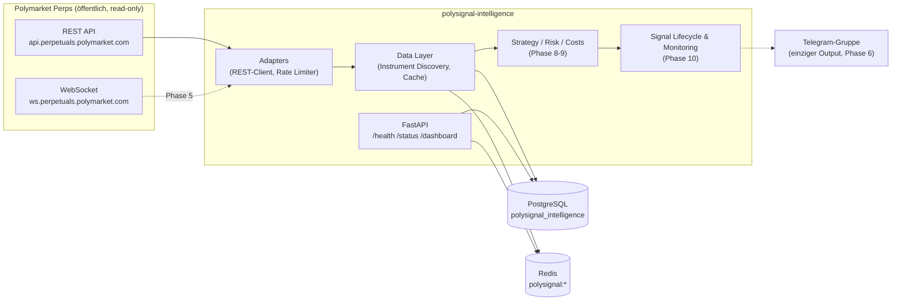

# polysignal-intelligence

Ein **rein lesender** Market-Intelligence- und Signalbot für **Polymarket Perps**.

Der Bot beobachtet ausschließlich **öffentliche** Marktdaten (REST + WebSocket),
bewertet Märkte und Setups regelbasiert und sendet selektive Long-/Short-Signale
in eine private Telegram-Gruppe. **Der Nutzer handelt manuell.**

> ⚠️ **Sicherheitsgrenzen (absolut):** Kein Live-Trading, keine Orderplatzierung,
> keine Wallet-Anbindung, kein Signing, keine privaten Account-/Positionsdaten.
> Telegram ist der einzige externe Output-Kanal. Der Bot ist ein reines
> Informations- und Signalsystem und garantiert keinerlei Performance oder Rendite.

## Status

| Phase | Inhalt | Status |
|-------|--------|--------|
| 1 | Projektisolierung | ✅ |
| 2 | Scaffold, Dependencies, Docker, Settings | ✅ |
| 3 | Datenmodelle, Alembic, PostgreSQL, Redis, Logging, Health | ✅ |
| 4 | Polymarket REST Client, Instrument Discovery | ✅ |
| 5+ | WebSocket-Layer, Telegram, Strategie, Risiko/Kosten, Lifecycle, Shadow Mode, Backtests | ⏳ geplant |

## Architekturüberblick



Schichtenregeln:
- Strategiecode sendet nie direkt Telegram und führt keine DB-Queries aus.
- Adapter treffen keine Strategieentscheidungen.
- Kosten- und Risiko-Engine sind in Live-/Shadow-/Backtest-Modus identisch.

Details: [`docs/architecture.md`](docs/architecture.md),
[`docs/strategy.md`](docs/strategy.md),
[`docs/operations.md`](docs/operations.md),
[`docs/security.md`](docs/security.md)

## Quick Start

### Voraussetzungen

- [uv](https://docs.astral.sh/uv/) (Python 3.12 wird automatisch bereitgestellt)
- Docker + Docker Compose (für PostgreSQL/Redis bzw. Vollbetrieb)

### 1. Konfiguration

```bash
cp .env.example .env
# .env editieren: POSTGRES_PASSWORD, DATABASE_URL, spaeter TELEGRAM_*
```

Die `.env` wird **ausschließlich** aus dem Repository-Root geladen.

### 2. Vollbetrieb mit Docker Compose

```bash
docker compose up --build -d
curl http://localhost:8000/health
curl http://localhost:8000/status
```

Migrationen laufen beim Containerstart automatisch (`alembic upgrade head`).
Alle Ressourcen sind projektisoliert: Container/Volumes/Netzwerk mit Präfix
`polysignal_`, Datenbank `polysignal_intelligence`, User `polysignal_user`,
Redis-Keys `polysignal:*`.

### 3. Lokale Entwicklung

```bash
uv sync                                   # Environment + Dependencies
docker compose up -d polysignal_postgres polysignal_redis
uv run alembic upgrade head               # Schema anlegen
uv run uvicorn app.main:app --reload      # API starten
```

### 4. Tests & Qualität

```bash
uv run pytest                # Tests (kein Netzwerk, keine echten API-Calls)
uv run ruff check .          # Lint
uv run ruff format --check . # Formatierung
uv run mypy                  # Typen
```

## Konfiguration

Alle Parameter, Schwellenwerte und Secrets kommen aus `.env` /
Environment-Variablen und sind in [`app/config.py`](app/config.py) typisiert.
Wichtige Gruppen: `APP_*`, `DATABASE_*`, `REDIS_*`, `POLYMARKET_*`,
`TELEGRAM_*`, `UNIVERSE_*`, `DATA_QUALITY_*` — siehe kommentierte
[`.env.example`](.env.example).

Marktuniversum V1: `AAPL-PERP` (Equity) und `BTC-PERP` (Crypto); weitere Märkte
nur per Konfiguration. Instrument-IDs werden **nie** fest codiert, sondern per
Discovery über `/v1/info/instruments` aufgelöst.

## Endpoints

| Endpoint | Zweck |
|----------|-------|
| `GET /health` | Prozess, PostgreSQL, Redis, Telegram-Konfiguration, WebSocket, Discovery-Frische |
| `GET /status` | Botzustand (inkl. Kill Switch), Universum, offene Signale, letzte Datenzeit |
| `GET /dashboard` | Kompakte JSON-Übersicht + Metriken |

## Lizenz / Haftung

Nur zu Informationszwecken. Keine Anlageberatung. Keine Garantie für
Signalqualität, Verfügbarkeit oder zukünftige Ergebnisse.
