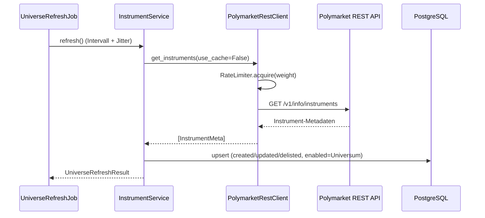
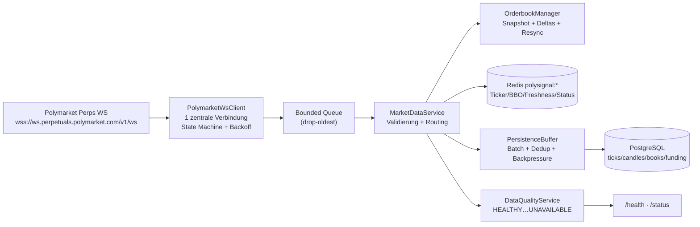
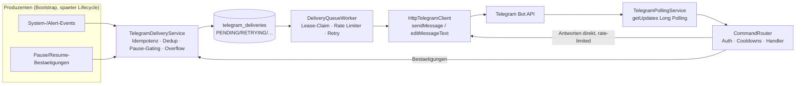
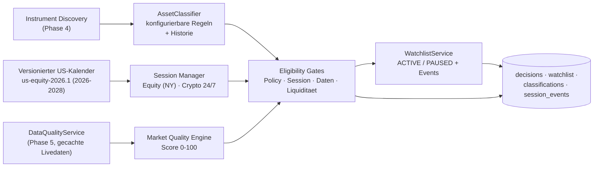
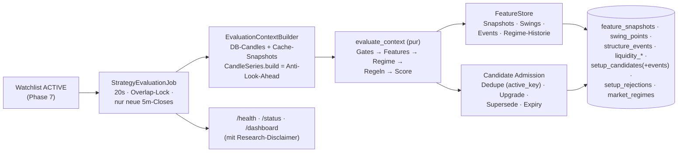

# Architektur

Stand: Phase 1–4 (Scaffold, Datenbank, REST-Client, Instrument Discovery).

## Schichten

```
app/
├── adapters/        # I/O: Polymarket REST + WebSocket, Telegram (Phase 6), Rate Limiter
├── domain/          # Enums, Value Objects, Lifecycle-Definition – persistenz- und I/O-frei
├── data/            # Instrument Discovery, Market Cache (Redis), spaeter Candle/Orderbook-Services
├── repositories/    # SQLAlchemy ORM + Repositories (einzige DB-Zugriffsschicht)
├── strategy/        # Phase 8 – regelbasierte Research-Engine: purer Kern (Features/Regime/Regeln/Score) + Context-Builder/Feature-Store als Adapter; kein LLM-Einfluss
├── costs/ risk/     # Phase 9 – identisch fuer Live/Shadow/Backtest
├── monitoring/      # Phase 7/10 – Sessions, Signal-Lifecycle
├── jobs/            # periodische Tasks (Universe Refresh aktiv; weitere folgen)
├── api/             # FastAPI: /health, /status, /dashboard
└── observability/   # JSON-Logging (Secret-Redaction), Metriken, Alerts
```

Regeln:
- **Strategie** ruft weder Telegram noch DB direkt auf – nur ueber Ports/Repositories.
- **Adapter** treffen keine Strategieentscheidungen.
- Business-Logik ist ohne REST/WS/Telegram/DB testbar (siehe `tests/`).

## Datenfluss (aktuell implementiert)



## Persistenz

12 Tabellen (Alembic `0001`): `instruments`, `market_ticks`, `candles`,
`orderbook_snapshots`, `funding_rates`, `market_regimes`, `signals`,
`signal_events`, `strategy_decisions`, `fee_schedule_versions`,
`system_events`, `telegram_deliveries`.

- Alle Zeitstempel UTC (`timestamptz`); Telegram-Darstellung in konfigurierbarer
  User-Timezone (Rendering ab Phase 6).
- Preise als `NUMERIC(38,18)`, JSON-Spalten als `JSONB` (PostgreSQL) bzw.
  `JSON` (SQLite in Tests).
- Idempotenz: Unique Keys auf `candles(instrument, timeframe, open_time)`,
  `signal_events.idempotency_key`, `telegram_deliveries.idempotency_key`.

## REST-Client

- Gewichteter Token-Bucket (Budget standardmaessig 800/min, Polymarket-Limit 1000/min).
- Begrenzte Retries (Default 3) mit Exponential Backoff + Jitter, `Retry-After`
  wird respektiert – keine aggressiven Retry-Loops.
- TTL-Response-Cache fuer Instrumente und Klines.
- Kline-Pagination folgt dem `more`-Flag mit hartem Seitenlimit.


## WebSocket Data Layer (Phase 5)

Nur Dateninfrastruktur - keinerlei Handels-, Strategie- oder Signal-Logik.

### Datenfluss



### Connection State Machine

```
DISCONNECTED -> CONNECTING -> CONNECTED
CONNECTED -(Fehler/Heartbeat-Timeout)-> RECONNECTING -> CONNECTED
RECONNECTING -(zu viele Versuche im Fenster)-> DEGRADED -(Erfolg)-> CONNECTED
beliebig -> STOPPING -> DISCONNECTED (Graceful Shutdown)
```

- Exponential Backoff `min..max` mit Jitter; Versuche werden in einem
  rollierenden Fenster gezaehlt (`POLYMARKET_WS_MAX_RECONNECT_ATTEMPTS` in
  `POLYMARKET_WS_RECONNECT_WINDOW_SECONDS`).
- Oberhalb des Limits: `DEGRADED`, weitere Versuche im Max-Backoff-Takt -
  kein Busy-Loop, kein Aufgeben.
- Heartbeat via WS-Ping/Pong (`PING_INTERVAL`/`PING_TIMEOUT`); Timeout wirft
  im `recv()` und triggert den Reconnect-Pfad.
- Nach jedem Reconnect wird das zuletzt gewuenschte Subscription-Set
  vollstaendig wiederhergestellt (idempotentes Diffing in
  `set_subscriptions`).
- Subscriptions folgen dem Discovery-Universum: der `UniverseRefreshJob`
  ruft nach jedem Refresh `MarketDataService.sync_universe()` auf;
  Delistings werden unsubscribed und ihr In-Memory-State entfernt.

### Channels

Pro aktivem Instrument: `tickers::<id>`, `bbo::<id>`, `book::<id>`,
`trades::<id>`, `klines::<id>::<tf>` fuer die konfigurierten Timeframes
(Default 1m/5m/15m/1h). API-Limit 100 Subscriptions/Verbindung wird als
Obergrenze erzwungen. Funding-Updates kommen im Ticker-Payload mit; ein
separater oeffentlicher Funding-WS-Channel existiert nicht.

### Validierung

Jedes Event wird vor Verarbeitung geprueft (`app/data/event_validation.py`):
Instrument-Zuordnung, Zeitstempel (ms, Plausibilitaetsfenster), endliche
positive Preise, keine negativen Mengen, kein NaN/Infinity, BBO `ask >= bid > 0`,
gueltige Candle-Timeframes und OHLC-Konsistenz, Outlier-Check gegen den
letzten Mark Price (`DATA_OUTLIER_MAX_DEVIATION_BPS`), Zeitreihen-Ordnung
pro Channel, Sequenzvalidierung im Orderbuch. Ungueltige Events werden mit
strukturiertem Grund verworfen, gezaehlt (Metrics + Tracker) und geloggt -
niemals verarbeitet, niemals Prozessabbruch.

### Orderbuch: Snapshot / Delta / Resync

- Initialisierung nur aus Snapshot; Deltas setzen Level (`qty=0` entfernt).
- Sequenzluecke, Delta vor Snapshot oder gekreuztes Buch => Buch wird als
  unzuverlaessig markiert, State geleert und ein Resync angefordert
  (Unsubscribe/Subscribe des `book`-Channels, rate-limited, als System-Event
  persistiert). Bis zum neuen Snapshot meldet das Buch nie "fresh".
- Abgeleitete Groessen: Best Bid/Ask, Mid, Spread absolut/bps,
  Top-of-Book-Depth, kumulative Tiefe (Top-N-Level oder innerhalb X bps),
  Zeitstempel der letzten verlaesslichen Aktualisierung.

### Cache & Freshness (Redis, Praefix `polysignal:`)

Key-Layout siehe `app/data/market_cache.py`. Freshness-Klassen pro Channel:
`FRESH` (Alter <= 50 % der Schwelle), `AGING` (<= Schwelle), `STALE`
(> Schwelle), `INVALID` (Invalid-Burst im Fenster), `RESYNCING` (Orderbuch),
`UNKNOWN` (nie Daten). Schwellen: `DATA_FRESHNESS_*_SECONDS`.
Redis-Ausfall degradiert den Cache (Zaehler + Flag), stoppt aber nie den Feed.

### Data Quality (Entscheidungsregeln)

Pro Instrument, erste zutreffende Regel gewinnt - Details und Begruendung in
`app/data/data_quality.py`:

1. `UNAVAILABLE` - nie Daten und WS nicht verbunden, oder alle kritischen
   Channels stale/unbekannt bei getrennter/degradierter Verbindung
2. `DATA_INVALID` - >= `DATA_QUALITY_INVALID_EVENT_THRESHOLD` invalide Events
   im Fenster
3. `ORDERBOOK_RESYNCING` - Buch wartet auf Snapshot-Resync
4. `DATA_STALE` - ein kritischer Channel (Ticker/BBO/Orderbuch) STALE/UNKNOWN
5. `DEGRADED` - kritischer Channel AGING, Trades/Candles STALE, WS
   RECONNECTING/DEGRADED, Persistenz-Buffer oder Cache degradiert, oder
   Mark/Index/Mid-Divergenz > `DATA_QUALITY_MARK_DIVERGENCE_DEGRADED_BPS`
6. `HEALTHY`

Spaetere Phasen duerfen nur bei `HEALTHY` neue Signale erzeugen.

### Persistenz-Batching

`PersistenceBuffer` entkoppelt Feed und DB: begrenzte Puffer (drop-oldest),
Flush nach Batchgroesse oder Intervall, Dedup-Keys (z. B. nur der letzte
Stand einer laufenden Candle, 1 Tick / 5 s, 1 Snapshot / min, Funding nur bei
Aenderung). Flush-Fehler markieren den Buffer als degraded (fliesst in die
Datenqualitaet ein), der Feed laeuft weiter.

## Telegram-Layer (Phase 6)

Reiner Kommunikations- und Kontrollkanal - keine Strategie-, Risiko-, Kosten-
oder Signallogik (per Isolationstest erzwungen).



### Delivery-Modell

Jede Delivery traegt: `delivery_id` (UUID), `idempotency_key` (DB-unique),
Typ, Operation (SEND/EDIT), Prioritaet 1-4, typisierten JSON-Payload,
`attempt_count`, `scheduled_at`, Lease, Fehlerklasse (ohne sensible Inhalte),
`correlation_id`/`signal_id`/`system_event_id`. Zustaende: PENDING →
PROCESSING → SENT/EDITED bzw. RETRYING → … → DEAD_LETTER, daneben FAILED
(permanent), SKIPPED_DUPLICATE, CANCELLED.

### Idempotenz & Lease-Recovery

- Der `idempotency_key` ist datenbank-unique: eine gesendete Delivery wird
  nie erneut gesendet - auch nicht nach Prozessneustart.
- Startup-Meldung: genau eine pro Application-Start-Correlation-ID.
- PENDING/RETRYING werden nach Neustart automatisch weiterverarbeitet;
  PROCESSING mit abgelaufenem Lease wird beim naechsten Claim zurueckgewonnen.

### Prioritaeten & Overflow

1 kritisch (SYSTEM_ERROR, SIGNAL_STOP/EXIT/INVALIDATED) · 2 hoch (DATA_STALE,
WEBSOCKET_DEGRADED, BOT_PAUSED/RESUMED, Startup/Shutdown/Warnungen) ·
3 normal (Signal-Lifecycle-Updates) · 4 niedrig (WATCHLIST, DAILY_STATUS).
Bei vollem Queue-Limit werden zuerst offene Prio-4/3-Deliveries verworfen
(CANCELLED); Prio 1-2 wird nie verdraengt und nie abgewiesen.

### Rate Limits & Retries

Pro Chat: max. `TELEGRAM_GROUP_MESSAGES_PER_MINUTE` (Default 18) im
Sliding Window, >= `TELEGRAM_GROUP_MIN_INTERVAL_SECONDS` Abstand, separates
konservatives Edit-Intervall. Fehlerklassifikation: 429 → Retry mit
`retry_after`; Netzwerk/5xx → Exponential Backoff + Jitter (begrenzt);
400/403/404 → FAILED (permanent); 401 → Subsystem UNAVAILABLE. Erschoepfte
Retries → DEAD_LETTER (System-Event + sichtbar in /status und /dashboard).

### Client-Entscheidung

Bewusst ein duenner httpx-Client hinter dem `TelegramClient`-Protokoll statt
aiogram/python-telegram-bot: Rate Limiting, Retries, Idempotenz und Command-
Routing liegen ohnehin in eigenen, getesteten Schichten; das Protokoll haelt
den Transport austauschbar. V1 nutzt ausschliesslich Long Polling - es gibt
keinen nach aussen offenen Webhook-Endpunkt.

## Marktselektion & Sessions (Phase 7)

Beantwortet ausschliesslich: Welche Instrumente sind jetzt technisch
analysierbar - und warum (nicht)? Keine Handelsidee, keine Richtung; die
Begriffe LONG/SHORT/Entry/Stop/Target/Leverage existieren in diesem Layer
nicht (testseitig erzwungen).



### Asset-Klassifikation

Regelreihenfolge (erste Regel gewinnt): (1) Metadaten-Kategorie ueber die
konfigurierbare Category-Map (Confidence 0.95), (2) konfigurierbare
Symbol-Map (Confidence 0.6; standardmaessig LEER - keine hartkodierten
Symbol-Annahmen), (3) UNKNOWN (0.0, nie analysiert). Jede Entscheidung wird
mit Quelle/Regel/Confidence/Zeitstempel in `asset_classifications`
historisiert (Append nur bei Aenderung). Policies: EQUITY + CRYPTO erlaubt;
INDEX/COMMODITY/FX `DISABLED_BY_POLICY` bis explizit per
`MARKET_SELECTION_ASSET_CLASS_POLICIES_JSON` aktiviert.

### Sessions & Kalender

- Equity strikt in `America/New_York` (DST via IANA); Regular 09:30-16:00,
  Pre-Market ab 04:00 / After-Hours bis 20:00 ohne aktive Analyse in V1.
- Early Closes sind rein kalenderbasiert (13:00 ET per
  `EQUITY_EARLY_CLOSE_DEFAULT`), nie eine generische Regel.
- Lokaler, versionierter Kalender (`app/sessions/us_equity_calendar_data.py`,
  Version `us-equity-2026.1`, Abdeckung 2026-2028, NYSE-Beobachtungsregeln
  dokumentiert). Kein Laufzeit-Netzzugriff. Datum ausserhalb der Abdeckung,
  Versions-Mismatch oder deaktivierter Kalender => `CALENDAR_UNAVAILABLE`
  (Equity konservativ blockiert, nie stillschweigend "regular").
- Crypto: `CRYPTO_24_7`; optionale UTC-Thin-Liquidity-Fenster fuehren bei
  Policy `LIMITED_SESSION` zu verschaerften Schwellen (Spread x0.7,
  Tiefe/Volumen x1.5), blockieren aber nicht.

### Market Quality Score (0-100)

Reiner Daten-/Handelbarkeits-/Liquiditaetsscore - kein Indikator, kein
Trend, kein Funding, keine Richtung. Komponenten: Datenqualitaet 30
(HEALTHY voll, DEGRADED halb, sonst 0), Spread 20 (voll bis T/2, linear bis
T), Tiefe 20 (schwaechere Buchseite zaehlt; nur aus frischem, verlaesslichem
Buch), 24h-Volumen 15 (aus dem oeffentlichen `statistics`-WS-Channel; >=2x
Minimum voll), Marktstatus 10, Mark/Index/Mid-Konsistenz 5. Fehlende Werte
zaehlen nie positiv.

### Eligibility (harte Gates, Score kann sie nie ueberstimmen)

Reihenfolge: Delisting/Konfiguration -> Denylist (schlaegt alles) ->
Asset-Class-Policy -> Session/Kalender (Allowlist kann das nie umgehen) ->
Marktstatus -> Datenqualitaet (DEGRADED nur mit
`MARKET_SELECTION_ALLOW_DEGRADED_DATA`) -> Orderbuch-Frische -> BBO/Mark
Price -> Volumen -> Spread (strikt unter Schwelle) -> Tiefe ->
Preiskonsistenz -> Mindestscore (Default 70). Alle Gruende werden gesammelt
und strukturiert persistiert; der erste blockierende Gate bestimmt den
Status.

### Watchlist-Lifecycle

Kandidaten = ELIGIBLE und Allowlist; Ranking nach Quality Score, Top-N
(`MARKET_SELECTION_MAX_WATCHLIST_SIZE`). Uebergaenge erzeugen Events
(ADDED/PAUSED/RESTORED/REMOVED) und unveraenderliche Decision-Rows (nur bei
Outcome-Aenderung - idempotente Zyklen erzeugen keine Duplikate). Restart:
Watchlist wird aus PostgreSQL wiederhergestellt und im naechsten Zyklus
revalidiert. DB-Ausfall: nicht persistierte Zustandswechsel werden nie als
erfolgreich gemeldet; der Coordinator ist DEGRADED und retried.

### Scheduling

`MarketSelectionCoordinator` laeuft alle `MARKET_SELECTION_REFRESH_SECONDS`
(Default 30 s) mit asyncio-Lock gegen Ueberlappung; UniverseRefresh triggert
sofort. Nur gecachte Livedaten (Tracker, Orderbuch, DataQuality) - keine
REST-Last pro Bewertung. Session-Transitionen werden erkannt, persistiert
(`session_events`) und optional (Default aus) via Delivery Queue gemeldet;
im globalen PAUSED-Modus laeuft die technische Aktualisierung weiter, nur
optionale Meldungen entfallen.

## Strategy Research Foundation (Phase 8)

Erzeugt ausschliesslich interne Research-Artefakte (`SetupCandidate` /
`SetupRejection`) - keine Trade-Signale, keine Telegram-Ausgabe, keine
Entry/Stop/Target/Hebel/Positionsgroessen/Kosten (AST-Isolationstest).
Fachliche Details: [`docs/strategy.md`](strategy.md).



Kernentscheidungen:

- **Purer Kern**: `evaluate_context` arbeitet ohne I/O auf einem immutablen
  `EvaluationContext`; Adapter (Context-Builder, Feature-Store, Job) liegen
  aussen herum. Dieselben Eingaben liefern deterministisch dieselben
  Ergebnisse (getestet).
- **Anti-Look-Ahead** zentral in `CandleSeries.build()`: nur geschlossene
  Candles, Gap-/Staleness-Checks, keine Interpolation.
- **Idempotenz via DB-Constraints**: Swings/Struktur-/Liquiditaetsevents
  haben Unique-Identitaeten (Insert-ignoring-duplicates); der
  `active_key`-Unique auf `setup_candidates` verhindert doppelte aktive
  Kandidaten auch unter Races; Rejections aggregieren pro Zeitfenster-Bucket.
- **Kein REST im Strategiepfad**: Candles aus PostgreSQL (Phase 5),
  Marktkontext aus den In-Memory-Trackern/Buechern.

### Persistenz (Alembic `0004`)

8 neue Tabellen: `feature_snapshots`, `swing_points`, `structure_events`,
`liquidity_levels`, `liquidity_events`, `setup_candidates`,
`setup_candidate_events`, `setup_rejections`. Alle Zeilen tragen
`strategy_version` (+ `config_hash` wo relevant); `setup_candidate_events`
ist die unveraenderliche Lifecycle-Historie. Snapshot-Retention:
`STRATEGY_FEATURE_RETENTION_DAYS`.
