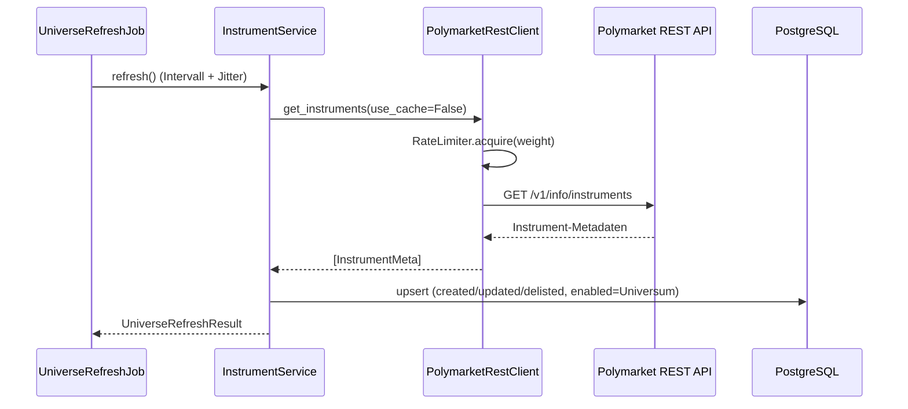
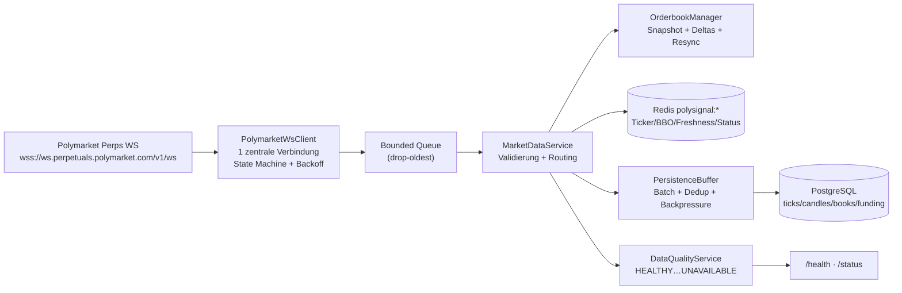

# Architektur

Stand: Phase 1–4 (Scaffold, Datenbank, REST-Client, Instrument Discovery).

## Schichten

```
app/
├── adapters/        # I/O: Polymarket REST + WebSocket, Telegram (Phase 6), Rate Limiter
├── domain/          # Enums, Value Objects, Lifecycle-Definition – persistenz- und I/O-frei
├── data/            # Instrument Discovery, Market Cache (Redis), spaeter Candle/Orderbook-Services
├── repositories/    # SQLAlchemy ORM + Repositories (einzige DB-Zugriffsschicht)
├── strategy/        # Phase 8 – regelbasierte Setups (kein LLM-Einfluss auf Entscheidungen)
├── costs/ risk/     # Phase 9 – identisch fuer Live/Shadow/Backtest
├── monitoring/      # Phase 7/10 – Sessions, Signal-Lifecycle
├── jobs/            # periodische Tasks (Universe Refresh aktiv; weitere folgen)
├── api/             # FastAPI: /health, /status, /dashboard
└── observability/   # JSON-Logging (Secret-Redaction), Metriken, Alerts
```

Regeln:
- **Strategie** ruft weder Telegram noch DB direkt auf – nur ueber Ports/Repositories.
- **Adapter** treffen keine Strategieentscheidungen.
- Business-Logik ist ohne REST/WS/Telegram/DB testbar (siehe `tests/`).

## Datenfluss (aktuell implementiert)



## Persistenz

12 Tabellen (Alembic `0001`): `instruments`, `market_ticks`, `candles`,
`orderbook_snapshots`, `funding_rates`, `market_regimes`, `signals`,
`signal_events`, `strategy_decisions`, `fee_schedule_versions`,
`system_events`, `telegram_deliveries`.

- Alle Zeitstempel UTC (`timestamptz`); Telegram-Darstellung in konfigurierbarer
  User-Timezone (Rendering ab Phase 6).
- Preise als `NUMERIC(38,18)`, JSON-Spalten als `JSONB` (PostgreSQL) bzw.
  `JSON` (SQLite in Tests).
- Idempotenz: Unique Keys auf `candles(instrument, timeframe, open_time)`,
  `signal_events.idempotency_key`, `telegram_deliveries.idempotency_key`.

## REST-Client

- Gewichteter Token-Bucket (Budget standardmaessig 800/min, Polymarket-Limit 1000/min).
- Begrenzte Retries (Default 3) mit Exponential Backoff + Jitter, `Retry-After`
  wird respektiert – keine aggressiven Retry-Loops.
- TTL-Response-Cache fuer Instrumente und Klines.
- Kline-Pagination folgt dem `more`-Flag mit hartem Seitenlimit.


## WebSocket Data Layer (Phase 5)

Nur Dateninfrastruktur - keinerlei Handels-, Strategie- oder Signal-Logik.

### Datenfluss



### Connection State Machine

```
DISCONNECTED -> CONNECTING -> CONNECTED
CONNECTED -(Fehler/Heartbeat-Timeout)-> RECONNECTING -> CONNECTED
RECONNECTING -(zu viele Versuche im Fenster)-> DEGRADED -(Erfolg)-> CONNECTED
beliebig -> STOPPING -> DISCONNECTED (Graceful Shutdown)
```

- Exponential Backoff `min..max` mit Jitter; Versuche werden in einem
  rollierenden Fenster gezaehlt (`POLYMARKET_WS_MAX_RECONNECT_ATTEMPTS` in
  `POLYMARKET_WS_RECONNECT_WINDOW_SECONDS`).
- Oberhalb des Limits: `DEGRADED`, weitere Versuche im Max-Backoff-Takt -
  kein Busy-Loop, kein Aufgeben.
- Heartbeat via WS-Ping/Pong (`PING_INTERVAL`/`PING_TIMEOUT`); Timeout wirft
  im `recv()` und triggert den Reconnect-Pfad.
- Nach jedem Reconnect wird das zuletzt gewuenschte Subscription-Set
  vollstaendig wiederhergestellt (idempotentes Diffing in
  `set_subscriptions`).
- Subscriptions folgen dem Discovery-Universum: der `UniverseRefreshJob`
  ruft nach jedem Refresh `MarketDataService.sync_universe()` auf;
  Delistings werden unsubscribed und ihr In-Memory-State entfernt.

### Channels

Pro aktivem Instrument: `tickers::<id>`, `bbo::<id>`, `book::<id>`,
`trades::<id>`, `klines::<id>::<tf>` fuer die konfigurierten Timeframes
(Default 1m/5m/15m/1h). API-Limit 100 Subscriptions/Verbindung wird als
Obergrenze erzwungen. Funding-Updates kommen im Ticker-Payload mit; ein
separater oeffentlicher Funding-WS-Channel existiert nicht.

### Validierung

Jedes Event wird vor Verarbeitung geprueft (`app/data/event_validation.py`):
Instrument-Zuordnung, Zeitstempel (ms, Plausibilitaetsfenster), endliche
positive Preise, keine negativen Mengen, kein NaN/Infinity, BBO `ask >= bid > 0`,
gueltige Candle-Timeframes und OHLC-Konsistenz, Outlier-Check gegen den
letzten Mark Price (`DATA_OUTLIER_MAX_DEVIATION_BPS`), Zeitreihen-Ordnung
pro Channel, Sequenzvalidierung im Orderbuch. Ungueltige Events werden mit
strukturiertem Grund verworfen, gezaehlt (Metrics + Tracker) und geloggt -
niemals verarbeitet, niemals Prozessabbruch.

### Orderbuch: Snapshot / Delta / Resync

- Initialisierung nur aus Snapshot; Deltas setzen Level (`qty=0` entfernt).
- Sequenzluecke, Delta vor Snapshot oder gekreuztes Buch => Buch wird als
  unzuverlaessig markiert, State geleert und ein Resync angefordert
  (Unsubscribe/Subscribe des `book`-Channels, rate-limited, als System-Event
  persistiert). Bis zum neuen Snapshot meldet das Buch nie "fresh".
- Abgeleitete Groessen: Best Bid/Ask, Mid, Spread absolut/bps,
  Top-of-Book-Depth, kumulative Tiefe (Top-N-Level oder innerhalb X bps),
  Zeitstempel der letzten verlaesslichen Aktualisierung.

### Cache & Freshness (Redis, Praefix `polysignal:`)

Key-Layout siehe `app/data/market_cache.py`. Freshness-Klassen pro Channel:
`FRESH` (Alter <= 50 % der Schwelle), `AGING` (<= Schwelle), `STALE`
(> Schwelle), `INVALID` (Invalid-Burst im Fenster), `RESYNCING` (Orderbuch),
`UNKNOWN` (nie Daten). Schwellen: `DATA_FRESHNESS_*_SECONDS`.
Redis-Ausfall degradiert den Cache (Zaehler + Flag), stoppt aber nie den Feed.

### Data Quality (Entscheidungsregeln)

Pro Instrument, erste zutreffende Regel gewinnt - Details und Begruendung in
`app/data/data_quality.py`:

1. `UNAVAILABLE` - nie Daten und WS nicht verbunden, oder alle kritischen
   Channels stale/unbekannt bei getrennter/degradierter Verbindung
2. `DATA_INVALID` - >= `DATA_QUALITY_INVALID_EVENT_THRESHOLD` invalide Events
   im Fenster
3. `ORDERBOOK_RESYNCING` - Buch wartet auf Snapshot-Resync
4. `DATA_STALE` - ein kritischer Channel (Ticker/BBO/Orderbuch) STALE/UNKNOWN
5. `DEGRADED` - kritischer Channel AGING, Trades/Candles STALE, WS
   RECONNECTING/DEGRADED, Persistenz-Buffer oder Cache degradiert, oder
   Mark/Index/Mid-Divergenz > `DATA_QUALITY_MARK_DIVERGENCE_DEGRADED_BPS`
6. `HEALTHY`

Spaetere Phasen duerfen nur bei `HEALTHY` neue Signale erzeugen.

### Persistenz-Batching

`PersistenceBuffer` entkoppelt Feed und DB: begrenzte Puffer (drop-oldest),
Flush nach Batchgroesse oder Intervall, Dedup-Keys (z. B. nur der letzte
Stand einer laufenden Candle, 1 Tick / 5 s, 1 Snapshot / min, Funding nur bei
Aenderung). Flush-Fehler markieren den Buffer als degraded (fliesst in die
Datenqualitaet ein), der Feed laeuft weiter.
