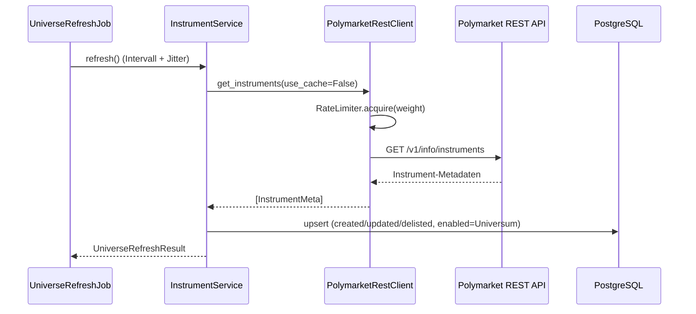

# Architektur

Stand: Phase 1–4 (Scaffold, Datenbank, REST-Client, Instrument Discovery).

## Schichten

```
app/
├── adapters/        # I/O: Polymarket REST (+ WS ab Phase 5), Telegram (Phase 6), Rate Limiter
├── domain/          # Enums, Value Objects, Lifecycle-Definition – persistenz- und I/O-frei
├── data/            # Instrument Discovery, Market Cache (Redis), spaeter Candle/Orderbook-Services
├── repositories/    # SQLAlchemy ORM + Repositories (einzige DB-Zugriffsschicht)
├── strategy/        # Phase 8 – regelbasierte Setups (kein LLM-Einfluss auf Entscheidungen)
├── costs/ risk/     # Phase 9 – identisch fuer Live/Shadow/Backtest
├── monitoring/      # Phase 7/10 – Sessions, Signal-Lifecycle
├── jobs/            # periodische Tasks (Universe Refresh aktiv; weitere folgen)
├── api/             # FastAPI: /health, /status, /dashboard
└── observability/   # JSON-Logging (Secret-Redaction), Metriken, Alerts
```

Regeln:
- **Strategie** ruft weder Telegram noch DB direkt auf – nur ueber Ports/Repositories.
- **Adapter** treffen keine Strategieentscheidungen.
- Business-Logik ist ohne REST/WS/Telegram/DB testbar (siehe `tests/`).

## Datenfluss (aktuell implementiert)



## Persistenz

12 Tabellen (Alembic `0001`): `instruments`, `market_ticks`, `candles`,
`orderbook_snapshots`, `funding_rates`, `market_regimes`, `signals`,
`signal_events`, `strategy_decisions`, `fee_schedule_versions`,
`system_events`, `telegram_deliveries`.

- Alle Zeitstempel UTC (`timestamptz`); Telegram-Darstellung in konfigurierbarer
  User-Timezone (Rendering ab Phase 6).
- Preise als `NUMERIC(38,18)`, JSON-Spalten als `JSONB` (PostgreSQL) bzw.
  `JSON` (SQLite in Tests).
- Idempotenz: Unique Keys auf `candles(instrument, timeframe, open_time)`,
  `signal_events.idempotency_key`, `telegram_deliveries.idempotency_key`.

## REST-Client

- Gewichteter Token-Bucket (Budget standardmaessig 800/min, Polymarket-Limit 1000/min).
- Begrenzte Retries (Default 3) mit Exponential Backoff + Jitter, `Retry-After`
  wird respektiert – keine aggressiven Retry-Loops.
- TTL-Response-Cache fuer Instrumente und Klines.
- Kline-Pagination folgt dem `more`-Flag mit hartem Seitenlimit.
